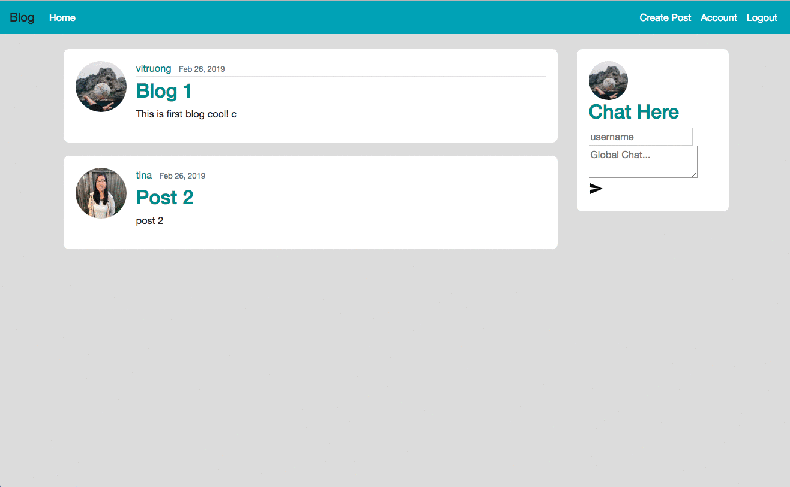
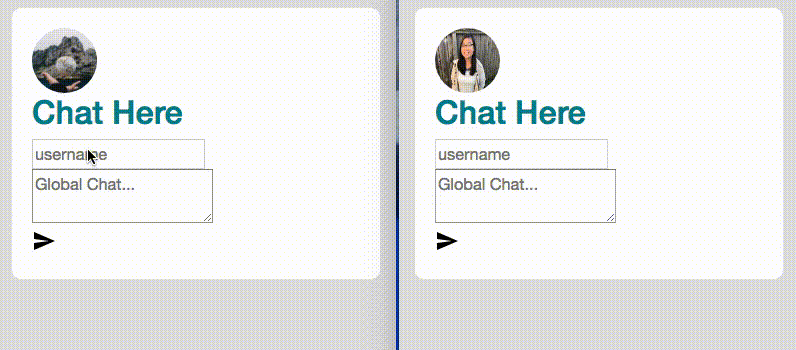

# Travel Blog With Pubnub Chat
A Blog that mulitple users can add posts to about travel plans. Users can register, login, and make a profile with a profile picture. They are able to add/edit/delete posts when logged in.
Pubnub chat is included for users to chat about travel plans. Users can also see who's online on the chat.

## Table of Contents

* [Tech Stack](#tech-stack)
* [Features](#features)
* [Chat Features](#chatfeatures)
* [Setup/Installation](#installation)
* [Looking Ahead](#future)

## <a name="tech-stack"></a>Tech Stack

__Frontend:__ HTML, CSS, Bootstrap, Jinja <br>
__Backend:__ Python, Flask, PostgreSQL, SQLAlchemy<br>

## <a name="features"></a> Features
Users can register and log in <br>
After logging in, users can change their username, email, or update their profile picture <br>
User can create a post by clicking "Create Post" on NavBar <br>
After filling in information for Title, Content, and clicking Post, new post is displayed on homepage<br>
User can view details of the post by clicking on post. User can also edit/delete their post only <br>


## <a name="chatfeatures"></a> Chat Feature
Chat Application with PubNub ChatEngine


## <a name="installation"></a>Setup/Installation

Requirements:

- PostgreSQL
- Python 2.7

To have this app running on your local computer, please follow the below steps:

Clone repository:
```
$ git clone https://github.com/tuongviatruong/blog-pt2-pubnub.git
```
Create a virtual environment:
```
$ virtualenv env
```
Activate the virtual environment:
```
$ source env/bin/activate
```
Install dependencies:
```
$ pip install -r requirements.txt
```

Create database and tables.
```
$ python 
>>> from flaskblog import db
>>> from flaskblog.model import User, Post
>>> db.create_all()

```
Run the app from the command line.
```
$ python server.py
```

## <a name='future'></a> Looking Ahead
* Add testing
* Show online users on chat to make it look better
